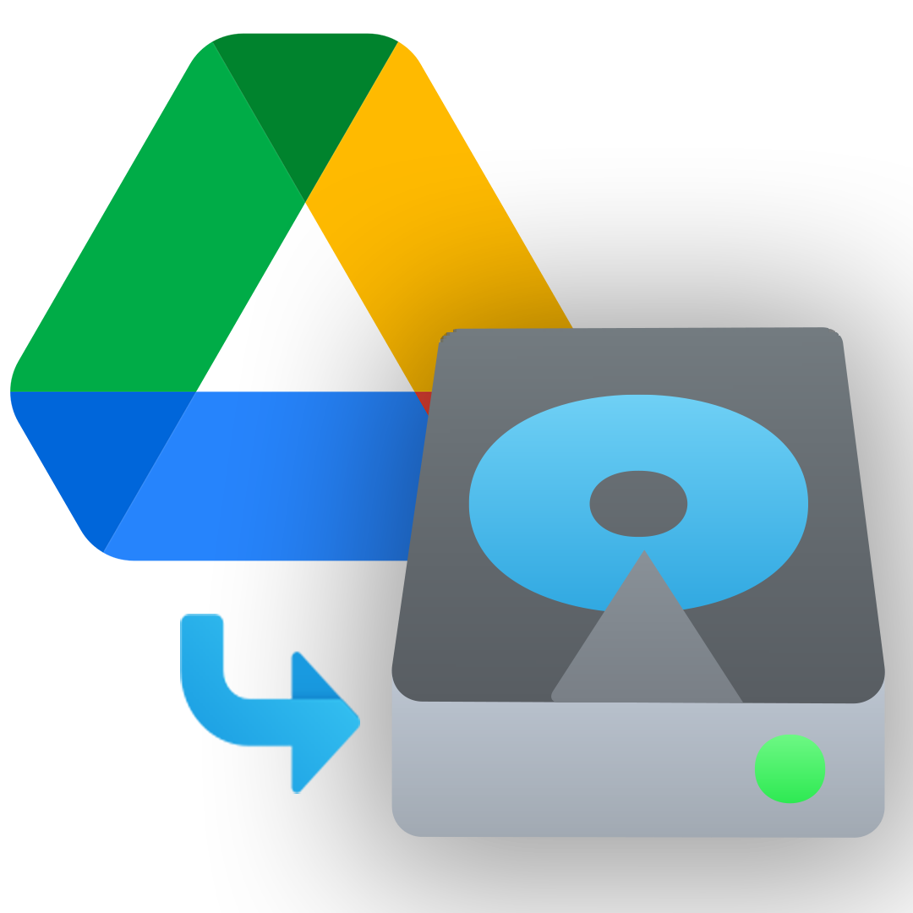

<div align="center">

# jDriveClonr

> A Java port of DriveClonrPro with enhanced features and performance!

[](https://www.oracle.com/java/technologies/downloads/)
[](https://openjfx.io/)
</div>

## Overview

New year, new project! Introducing **jDriveClonr**, the Java port of the original Python-based DriveClonrPro! This project delivers a more efficient and user-friendly alternative to the original, with a focus on performance, ease of use, and features!

Even before implementing multithreading, jDriveClonr was already faster than the original DriveClonrPro! It also _finally_ supports the TreeView for selecting files and folders to clone, a long-awaited feature. jDriveClonr is designed to be modular and extensible, making it easier to add new features and improvements in the future.

<div align="center">

</div>

## Features

- **Configurable Multithreading** - A long-awaited feature! Customize thread count via UI slider for optimal performance (1-10 threads)
- **TreeView Navigation** - At long last, intuitive selection of files and folders to clone! 
- **Shared Drive Support** - Full access to all your shared Google Drive content
- **Google Photos Cloning** - Coming soon!
- **Lazy-loading** - For a faster, lag-free UI experience
- **Improved Error Handling** - Better logging and error recovery
- **Modern JavaFX UI** - Native interface with hDPI scaling support
- **Document Format Options** - Export Google Workspace documents in various formats:
  - Google Docs → DOCX, PDF, TXT, HTML, MD
  - Google Sheets → XLSX, PDF, CSV, TSV, HTML
  - Google Slides → PPTX, PDF, TXT
  - Google Drawings → PNG, JPG, SVG, PDF
  - Google Jamboard → PDF

## Requirements and Build Instructions

### Google Drive API Credentials

> [!IMPORTANT]
> Without the `credentials.json` file, jDriveClonr **will not work**. Ensure that you have created a Google Drive API project and have the `credentials.json` file available.

This project does *not* come with the required Google Drive API credentials. You will need to create your own credentials to use this project.
Follow the instructions in the [Google Drive API documentation](https://developers.google.com/drive/api/v3/quickstart/java) to obtain your credentials.

> [!NOTE]
> jDriveClonr does not require the `.json` file to be in a specific directory. If it cannot find it, it will prompt you to select
> it from a file chooser dialog.

### System Requirements

- **Java:** JDK 21 (JDK 17+ may work but is untested)
- **JavaFX:** 21
- **Maven:** 3.8.5 or higher
- **OS:** Windows, macOS, or Linux. Anything that's not a toaster and has an internet connection should work.

### Building the Project

All requirements are listed in [pom.xml](pom.xml). To build the project, run the following command in the root directory:

```bash
mvnw clean install
```

Or, if you have a system-wide installation of Maven:

```bash
mvn clean install
```

This will compile jDriveClonr and install all necessary dependencies.

### Running the Application

```bash
mvn javafx:run
```

*Or `mvnw javafx:run` if you are using the wrapper.*

## Performance Tuning

jDriveClonr now features a thread count slider in the configuration screen that allows you to customize the number of concurrent download threads (1-10).

> [!WARNING]
> **Best Practice:** It is recommended to use 4-5 threads for optimal performance. Using more than 5 threads may result in rate-limiting by Google's API and other unpredictable behavior. The application will display a warning when selecting more than 5 threads.

## ❓ FAQ

<details>
<summary><b>What happened to the 'e' in Clon(e)r?</b></summary>
<p>`Clonr` looks cooler than `Cloner`. 'Nuff said.</p>
</details>

<details>
<summary><b>What can jDriveClonr clone that DriveClonrPro cannot?</b></summary>
<p>jDriveClonr shares a superset of features with DriveClonrPro. They both maintain the same base cloning abilities, 
including Google Workspace exporting, but jDriveClonr has additional features that are not present in DriveClonrPro:</p>

- 📁 jDriveClonr has a functional, lazily loaded TreeView for pruning and selecting files and folders to clone
- 🔄 jDriveClonr supports Shared Drives, which are not supported in DriveClonrPro
- 🔐 jDriveClonr fixes the issue of DriveClonrPro being unable to access certain shared files and folders
- ⚡ jDriveClonr is configurable multi-threaded, which allows for faster cloning
- 🖼️ jDriveClonr will support Google Photos cloning (coming soon)
- 💻 jDriveClonr uses JavaFX for the UI rather than Tkinter, providing a more modern UI with hDPI scaling support

</details>

<details>
<summary><b>What files can't be cloned with jDriveClonr?</b></summary>

Currently, jDriveClonr cannot clone:
- Google Forms
- Google Sites
- Google Maps/My Maps
- Google Keep
- File shortcuts

These files will likely never be supported due to the limitations of the Google Drive API, however we are actively looking into ways around this.

</details>

<details>
<summary><b>Why do you keep making DriveClonr clones?</b></summary>
<p>I do not know. If you have any recommendations for good rehab facilities, please let me know.</p>
</details>

## 🤝 Contributing

Contributions are welcome! <!-- Coming soon: Please see our [CONTRIBUTING.md](CONTRIBUTING.md) file for details on how to contribute to the project and our [TESTING.md](TESTING.md) file for testing guidelines. -->

### Reporting Issues

If you encounter a bug, have a feature request, or want to suggest documentation improvements, please use our issue templates:

- [Report a bug](https://github.com/username/jDriveClonr/issues/new?template=bug_report.md)
- [Request a feature](https://github.com/username/jDriveClonr/issues/new?template=feature_request.md)
- [Suggest documentation improvements](https://github.com/username/jDriveClonr/issues/new?template=documentation.md)
- [Report performance issues](https://github.com/username/jDriveClonr/issues/new?template=performance.md)
